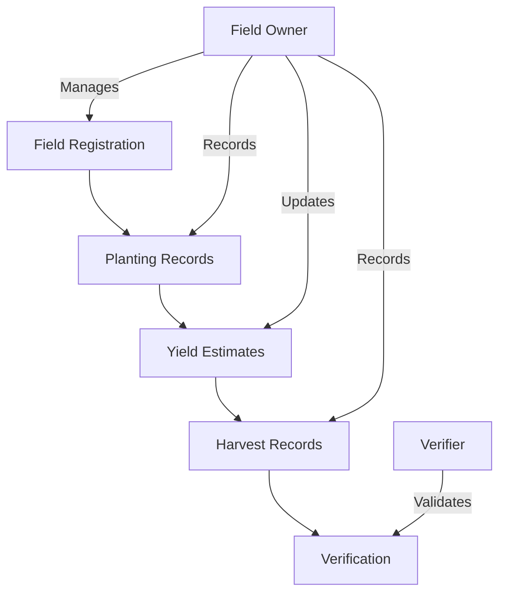

# Crop Yield Tracking Ledger

A blockchain-based system for tracking and verifying agricultural production from planting to harvest, providing transparency and traceability in the food supply chain.

## Overview

The Crop Yield Tracking Ledger enables farmers to create verifiable records of their agricultural production throughout the growing season. The system provides:

- Field registration and management
- Planting documentation
- Yield estimation tracking
- Harvest recording
- Third-party verification

This solution creates transparency in the food supply chain while providing farmers with an immutable record of their production metrics that can be used for insurance claims, supply chain planning, and consumer trust-building.

## Architecture

The system is built on a single smart contract that manages field registration, production tracking, and harvest verification.



### Core Data Structures
- Fields: Stores field information including ownership and location
- Plantings: Records crop details and planting dates
- Yield Estimates: Tracks ongoing yield predictions
- Harvests: Documents final harvest amounts and verification status
- Verifiers: Maintains list of authorized verification entities

## Contract Documentation

### harvest-tracker.clar

The main contract managing all crop tracking functionality.

#### Key Functions

**Field Management**
- `register-field`: Register a new agricultural field
- `transfer-field-ownership`: Transfer field ownership to another principal

**Production Tracking**
- `record-planting`: Document new plantings
- `record-yield-estimate`: Log yield estimates during growth
- `record-harvest`: Record final harvest data

**Verification**
- `register-verifier`: Register as a harvest verifier
- `verify-harvest`: Verify recorded harvest data

## Getting Started

### Prerequisites
- Clarinet
- Stacks blockchain wallet

### Basic Usage

1. Register a field:
```clarity
(contract-call? 
  .harvest-tracker 
  register-field 
  "North Field" 
  u10000 
  i40123456 
  i-74123456
)
```

2. Record a planting:
```clarity
(contract-call? 
  .harvest-tracker 
  record-planting 
  u1 
  "Corn" 
  "Silver Queen" 
  u1000 
  u1100
)
```

## Function Reference

### Field Management

```clarity
(register-field (name (string-ascii 50)) (size uint) (latitude int) (longitude int))
```
- Registers a new field
- Returns: (ok uint) with field ID

```clarity
(transfer-field-ownership (field-id uint) (new-owner principal))
```
- Transfers field ownership
- Returns: (ok true)

### Production Tracking

```clarity
(record-planting (field-id uint) (crop-type (string-ascii 50)) (variety (string-ascii 50)) (planting-date uint) (expected-harvest-date uint))
```
- Records a new planting
- Returns: (ok uint) with planting ID

```clarity
(record-yield-estimate (field-id uint) (planting-id uint) (estimated-yield uint) (notes (string-ascii 200)))
```
- Records a yield estimate
- Returns: (ok uint) with estimate ID

```clarity
(record-harvest (field-id uint) (planting-id uint) (actual-yield uint) (quality-notes (string-ascii 200)))
```
- Records final harvest data
- Returns: (ok true)

## Development

### Testing

1. Clone the repository
2. Install Clarinet
3. Run tests:
```bash
clarinet test
```

### Local Development
1. Start Clarinet console:
```bash
clarinet console
```
2. Deploy contract:
```clarity
(contract-call? .harvest-tracker ...)
```

## Security Considerations

### Access Control
- Field operations restricted to registered owners
- Harvest verification limited to registered verifiers
- Ownership transfer requires current owner authorization

### Data Validation
- Coordinate validation ensures realistic field locations
- Yield amounts must be non-zero
- Prevents duplicate harvest records
- Single verification per harvest

### Limitations
- No support for partial harvests
- Simplified verification model
- No support for field subdivision
- Fixed units for measurements (metric system)